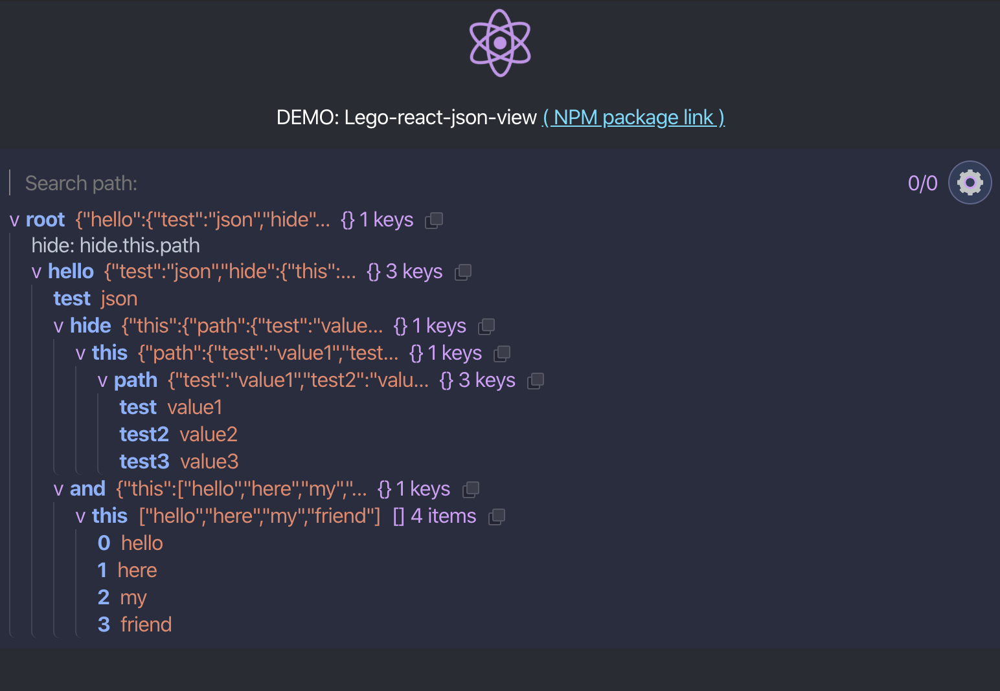

## **Lego-react-json-viewer**

---

# Install:

npm:
```md
npm i -S lego-react-json-view
```

yarn:
```md
yarn add lego-react-json-view
```
---

## DEMO

[DEMO: lego-react-json-view](https://lego-react-json-view.netlify.com/)



---

## React Usage code example:

```tsx
// Import LegoView
import LegoView from "lego-react-json-view";
// ...
```
```tsx
//...
  // Use LegoReactJsonView with json data
  return <LegoView json={json} />;
//...
```

### Full example:
```tsx
import React from "react";
import ReactDOM from "react-dom";

// Import LegoView
import LegoViewer from "lego-react-json-view";

const App = () => {
  const json = {
    hello: {
      test: "test json data",
      hide: {
        this: {
          path: {
            data: "inner data (hide.this.path)"
          }
        }
      }
    }
  };

  // Use LegoReactJsonView with json data
  return <LegoViewer json={json} />;
};

ReactDOM.render(<App />, document.getElementById("root"));
```

---

## **Main features:**
> - [x] Save **previously opened** paths in json;
> - [x] Collaps paths by **collaps filters**;
> - [x] **Search paths** in json.

---
---
---

TODO:
> **Custom filter settings:**
>
> - [x] Add filter;
> - [x] Delete filter;
> - [x] **Expanded** block will be restored after page reload (saved in localStorage - LS) ;
> - [x] **Show/hide** collapsed section will be restored after page reload (LS);
> - [-] Enable/disable filter (one by one).

> **"Search" in _json_:**
>
> - [x] _fuzzy_ search;
> - [x] Path search;
> - [x] Full json search
> - - heighlight all found results,
> - - collaps all unnecessary blocks in json after search;
> - [x] Find all paths in json tree;
> - [x] On _Enter_ - show all results.

> **Additional settings:**
>
> - [x] Copy button **clipboard**;
> - [x] Dynamic **font size** (buttons);
> - [x] Theme **dark/light** mode.

> **Friendly ui:**
>
> - [x] Settings toggle by button (on the right top corner ?);
> - [-] Redesign button (it's not clear that it's a button =) );
> - [-] Think about search counter (sometimes it's too big or too small);
> - [-] Clipboard button scale with font size;
> - [-] ? Show tooltip (Copied) after clicking on clipboard;
> - [-] Toggle dark/light theme;
> - [-] Clear search text (button).