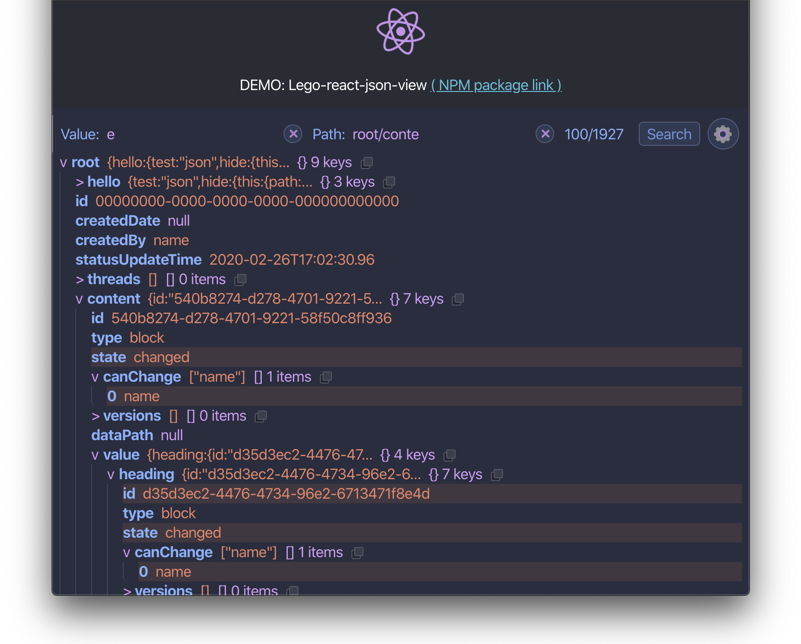

## **Lego-react-json-view**

JSON viewer with Dark Theme, Search, Filters, paths Reopening and more =)

# `Install` (npm / yarn):

```md
npm i -S lego-react-json-view
```

```md
yarn add lego-react-json-view
```

## DEMO

[`DEMO link`: `lego-react-json-view`](https://lego-react-json-view.netlify.com/)



[](https://app.netlify.com/sites/lego-react-json-view/deploys)

---

## Quick-start - `React code example`:

```tsx
// Import LegoView
import LegoView from "lego-react-json-view";
// ...
```

```tsx
//...
// Use LegoReactJsonView with json data
return <LegoView json={json} />;
//...
```

### `Full example`:

```tsx
import React from "react";
import ReactDOM from "react-dom";

// Import LegoView
import LegoViewer from "lego-react-json-view";

const App = () => {
  const json = {
    hello: {
      test: "test json data",
      hide: {
        this: {
          path: {
            data: "inner data (hide.this.path)"
          }
        }
      }
    }
  };

  // Use LegoReactJsonView with json data
  return <LegoViewer json={json} />;
};

ReactDOM.render(<App />, document.getElementById("root"));
```

## Custom settings:

**Settings object** (propsSettings) could be passed directly in _react component_:

```tsx
...
  const propsSettings = {
    theme: "auto",
    fontSize: "0.81",
    searchLimit: "111",
    isExpanded: false
  };

  return <LegoViewer
    json={json}
    settings={propsSettings}
  />
...
```

### Settings:

- **fontSize** - json font size;
- **searchLimit** - max number of showing results;
- **theme** - color theme mode ("light" | "dark" | "auto");
- **isExpanded** - is expanded by default all json objects?

Note:

- _propsSettings_ have **higher priority**, then **inner** (witch could be changed via UI interface)!
- inner settings will be dropped to _propsSettings_ after page reload!

## **Main features:**

> - [x] Save **previously opened** paths in json;
> - [x] Collaps paths by **collaps filters**;
> - [x] **Search paths** in json.

---

---

---

TODO:

> **Custom filter settings:**
>
> - [x] Add filter;
> - [x] Delete filter;
> - [x] **Expanded** block will be restored after page reload (saved in localStorage - LS) ;
> - [x] **Show/hide** collapsed section will be restored after page reload (LS);
> - [-] Enable/disable filter (one by one).

> **"Search" in _json_:**
>
> - [x] _Value_ search;
> - [x] _Path_ search;
> - [x] _fuzzy_ search;
> - [x] _Full_ json search
> - - _heighlight_ all found results,
> - - _collaps all unnecessary_ blocks in json after search;
> - [x] Find _all paths_ in json tree;
> - [x] On _Enter_ - show all results;
> - [x] _Search_ button;
> - [x] _Path_ could be _separated_ by items: [**"."**, **"/"**, **"\\"**].

> **Additional settings:**
>
> - [x] Copy button **clipboard**;
> - [x] Dynamic **font size** (buttons);
> - [x] Auto change theme **dark/light** mode (based on macOS theme);
> - [x] Manual theme change (**dark/light/auto** mode).

> **Friendly ui:**
>
> - [x] Settings toggle by button (on the right top corner ?);
> - [x] Toggle dark/light theme;
> - [-] Redesign button (it's not clear that it's a button =) );
> - [x] Think about search counter (sometimes it's too big or too small);
> - [-] Clipboard button scale with font size;
> - [-] ? Show tooltip (Copied) after clicking on clipboard;
> - [x] onEnter search with empty input - clean results;
> - [x] Clear search text (button);
> - [x] Add settings close button;
> - [-] Input animation (?);
> - [-] On Search loading animations.
